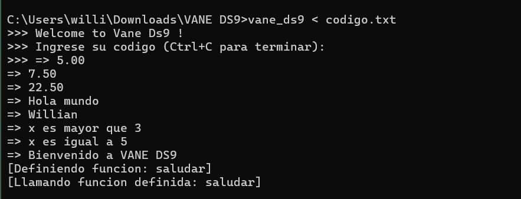

# VANE DS9 
Pequeño intérprete “MiniPython” escrito con **Flex 2.6.4** y **Bison 3.8.2**.  
Permite asignaciones, expresiones aritméticas y condicionales `if / elif / else` (ejecuta solo el primer bloque verdadero, al estilo Python).

---

##  Estructura del repositorio

| Ruta / Archivo | Descripción |
|----------------|-------------|
| `lexer.l` | Analizador léxico (Flex) |
| `scanner.y` | Analizador sintáctico (Bison) |
| `Condicional.txt` | Script de prueba con `if / elif / else` |
| `codigo.txt` | Script de prueba adicional |
| `img/` | Capturas de pantalla |


## Ejemplo de salida

```bat
vane_ds9 < codigo.txt
```


---

## ⚙️ Requisitos

* Flex **2.6.4** → `flex --version`
* Bison **3.8.2** → `bison --version`
* GCC (MinGW / MSYS2 en Windows)

---

## 🔧 Compilación (CMD / PowerShell)

```bat
flex lexer.l          && ^
bison -d scanner.y    && ^
gcc lex.yy.c scanner.tab.c -o vane_ds9
